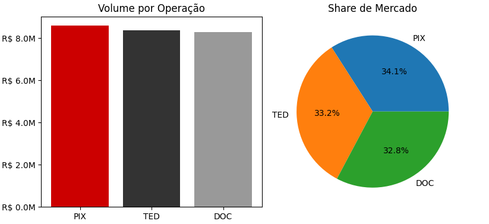

\# Desafio Bradesco - Análise de Dados

Este projeto faz parte de um desafio técnico para análise de dados.

\## 📂 Estrutura do Projeto

\- `data/`: Bases de dados utilizadas.

\- `notebooks/`: Análises exploratórias.

\- `src/`: Scripts Python de suporte.

\## 🛠️ Tecnologias

\- Python

\- Pandas

\- FAKER

\- RANDOM

\- SQLITE

\- MATPLOTLIB

\- Git/GitHub

